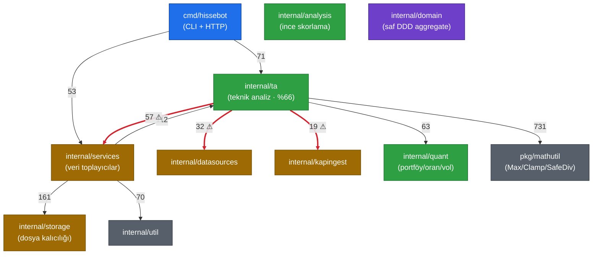

# hissebot — Mimari

> Otomatik üretildi: BMAD Document Project (kapsamlı tarama) — 2026-06-25
> Bağımlılık grafiği codebase-memory ile çıkarıldı (9.401 düğüm, 41.747 kenar).

## 1. Yönetici Özeti

`hissebot`, BIST hisseleri için veri toplama → analiz → raporlama hattını tek bir Go monolith'inde birleştirir. Mimari, **dosya tabanlı kalıcılık** (her hisse = bir klasör JSON) üzerine kuruludur ve harici veritabanı bağımlılığı taşımaz. Domain katmanı temiz (altyapı sızıntısı yok), hata yönetimi tutarlı, eşzamanlılık disiplinli. Yapısal yük `internal/ta` paketinde toplanmıştır (kod tabanının %66'sı).

## 2. Katman Modeli

```
cmd/hissebot (CLI + HTTP orkestrasyon)
        │
        ▼
internal/services (veri toplayıcılar: tradingview, kap, tcmb, tuik, mkk, news)
        │            └──> internal/storage (dosya kalıcılığı: equity_store.go)
        ▼
internal/ta  ───────> internal/quant (portföy/oran/volatilite matematiği)
(teknik analiz,        internal/analysis (ince skorlama facade'ları)
 patern, forecast,
 profesyonel rapor)
        │
        ▼
internal/domain (saf DDD aggregate'leri — altyapı import etmez)
        │
        └──> pkg/mathutil, pkg/useragent (paylaşılan çekirdek)
```

### Sınır çağrı sayıları (graf doğrulaması)

| Kaynak → Hedef | Çağrı | Yorum |
|---|---|---|
| ta → mathutil | 731 | Sağlıklı paylaşılan çekirdek (Max/SafeDiv/Clamp) |
| services → storage | 161 | Servisler **somut** storage'a bağlı (port'ları atlıyor) |
| services → ta | 112 | Servisler analiz motorunu çağırıyor |
| hissebot → ta | 71 | CLI doğrudan analiz çağırıyor |
| ta → quant | 63 | TA, quant matematiğini kullanıyor |
| **ta → services** | **57** | ⚠ Yukarı doğru bağımlılık (yön tersliği) |
| ta → datasources | 32 | ⚠ Hesaplama çekirdeği I/O'ya uzanıyor |
| ta → kapingest | 19 | ⚠ Aynı sorun |

### Bağımlılık Grafiği (codebase-memory'den)

Aşağıdaki diyagram codebase-memory grafiğinden (9.401 düğüm, 41.747 kenar) çıkarılan paket-arası `CALLS` kenarlarını gösterir. Kenar etiketleri çağrı sayısıdır. Kırmızı (kalın) kenarlar **yön tersliği** olan mimari ihlalleri işaretler: hesaplama çekirdeği `ta`, altyapı katmanlarına (`services`, `datasources`, `kapingest`) yukarı doğru bağımlı.



> Sağlıklı yön: giriş → altyapı → hesaplama → domain/çekirdek. `pkg/mathutil` ve `internal/ta/ohlcv/types` en yüksek fan-in'li düğümlerdir (paylaşılan çekirdek, döngü yok). Kırmızı üç kenar tek yapısal kusurdur — düzeltme için arayüz enjeksiyonu (bkz. P1, [review-2026-06-25.md](./review-2026-06-25.md)).

## 3. Bileşen Sorumlulukları

| Paket | Sorumluluk | Dosya (src) |
|---|---|---|
| `cmd/hissebot` | CLI alt-komut yönlendirici, HTTP sunucuları (`api_server.go`, `report_server.go`) | 5 |
| `internal/domain` | Saf iş aggregate'leri (marketdata, financials, stocks, disclosures, macro, documents, kapextract) | 12 |
| `internal/services` | Dış kaynak veri toplayıcıları (tradingview, kap, tcmb, tuik, mkk, news, pricequality) | 34 |
| `internal/storage` | Dosya tabanlı `EquityStore` (JSON okuma/yazma) | 1 |
| `internal/repositories` | Port arayüzleri (7 interface) + memory/filedocuments adaptörleri | 3 |
| `internal/ta` | Teknik analiz, indikatör, patern, formasyon, forecast, profesyonel rapor (30 alt-paket) | 722 |
| `internal/quant` | Portföy, oran (rates), volatilite, enstrüman, solver matematiği | 13 |
| `internal/analysis` | İnce skorlama modülleri (fundamental, risk, technical, valuation) | 5 |
| `internal/kapingest` | KAP bildirim/belge ingestion ve belge zekası (document intelligence) | 18 |
| `internal/confidence` | Analiz güven skorlama + `ReviewRequired` eşiği (0.75) | 1 |
| `internal/wsclient` | Canlı market WebSocket istemcisi | 1 |
| `internal/config` | 51 alanlı düz `Config` struct + `Load()` (env tabanlı) | 1 |
| `internal/audit` | Append-only audit defteri (ledger) | 1 |
| `pkg/mathutil` | Max/Min/Clamp/SafeDiv — en yüksek fan-in'li çekirdek | — |

## 4. Veri Akışı (tipik analiz)

1. `sync` komutları dış kaynaklardan veriyi çeker → `internal/services/*` → `data/equities/{TICKER}/*.json`.
2. `financials calculate` ham bilançodan oranları hesaplar → `bilanco_hesaplari.json`.
3. `analyze -symbol X` → `internal/ta/analysis/engine.go` OHLCV + finansalları yükler, indikatör/patern/formasyon tarar, forecast üretir.
4. `internal/confidence` analizin güven skorunu hesaplar; `< 0.75` ise inceleme gerektirir olarak işaretler.
5. Profesyonel rapor `internal/ta/storage/professional_report.go` ile yazılır → `data/equities/{TICKER}/analysis/{YYYY-MM-DD}/`.

## 5. Eşzamanlılık & Kaynak Yönetimi

- **Worker pool deseni** disiplinli: `internal/services/financials/fetch.go:155-185` (WaitGroup + `defer close` + ctx cancel) örnek niteliğinde.
- HTTP gövdeleri `defer resp.Body.Close()` ile kapatılıyor; okumalar `io.LimitReader` ile sınırlı (ör. `news.go:219` 8MB).
- Paket düzeyinde değişebilir global durum yok; `init()` fonksiyonlarının ezici çoğunluğu (598) codegen lookup tablolarında.

## 6. Mimari Riskler (kod incelemesinden)

| Önem | Sorun | Kanıt |
|---|---|---|
| P1 | `ta` → `services`/`datasources`/`kapingest` yukarı bağımlılığı; çekirdek I/O'ya bağlı, birim testi zor | graf: 57/32/19 çağrı; `ta/analysis/engine.go:15-16` |
| P1 | Repository port'ları tanımlı ama atlanıyor; `services`/`ta` somut `storage`'a bağlı | graf: services→repositories = 0 |
| P1 | Kütüphane kodunda panik | `services/tradingview/charts.go:687` `mustJSON` |
| P2 | Tanrı dosyaları | `ta/storage/professional_report.go` 9.549 satır; `reportLabel` 719 satır |
| P2 | Skorlama eşikleri sabit literal | `confidence/score.go:18-62` (`0.75` kapısı) |
| P2 | Sıcak yolda `context.Background()` | `engine.go:2566`, `ta/storage/writer.go:315` |

Detay ve düzeltme önerileri: [review-2026-06-25.md](./review-2026-06-25.md).

## 7. Test Stratejisi

- 128 test dosyası (978 kaynaktan). `quant` paketi homojen kaplı.
- **Açıklar:** `internal/analysis/{fundamental,risk,technical,valuation}/scoring.go` ve `internal/confidence/score.go` (karar matematiği) testsiz.
- Makefile/golangci/CI-test workflow'u yok; tek workflow KAP attachment worker. Önerilen: `go test -race ./...` + lint CI.
